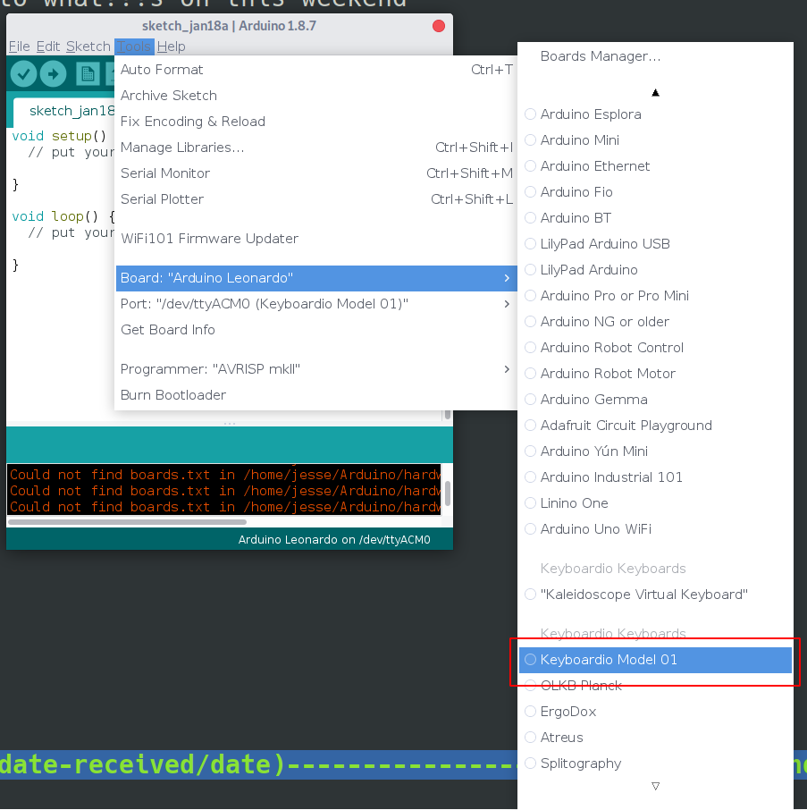
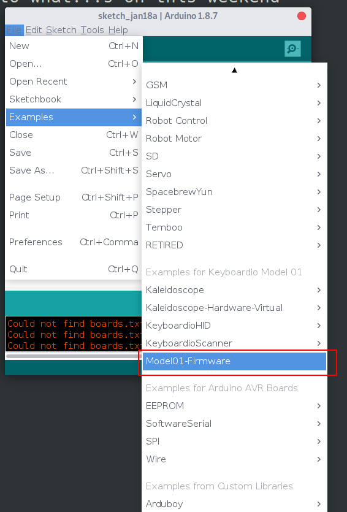
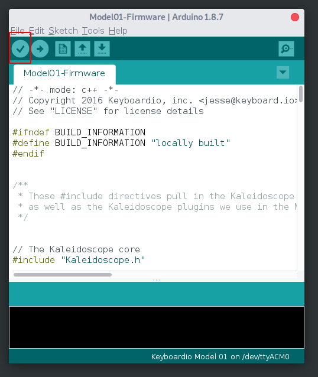
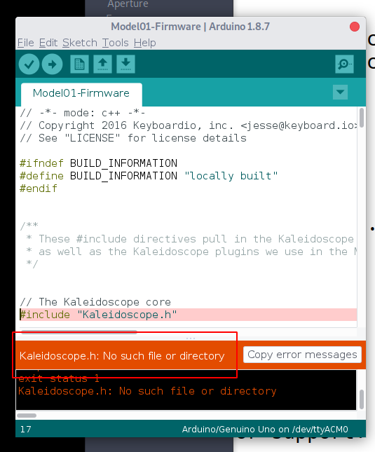
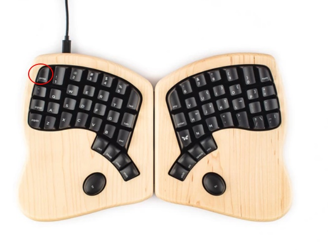
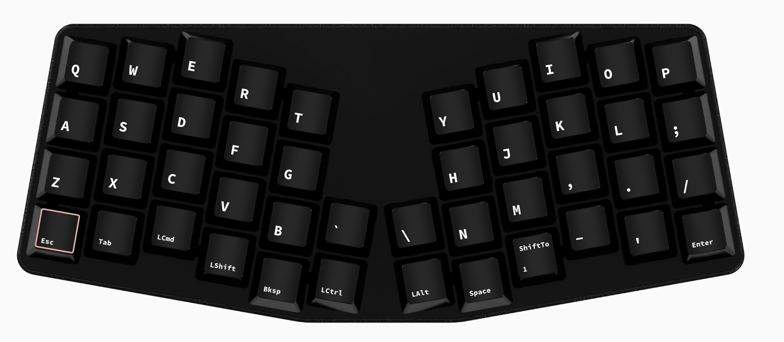

# Build and install the latest firmware for your keyboard

# Select your keyboard

1. Open the 'Tools' menu, click on 'Board' and then click on the name of your keyboard. In the screenshot, we picked 'Keyboardio Model 01'. (You may have to scroll through a long list of other boards to get there.)

2. Open the 'Tools' menu, click on "Port > ".  If your keyboard is not already selected, click on it to select it. (If there is only one option such as "COM3" try it, it's almost certainly the correct port.)

Next step: [Install the latest firmware on your keyboard](#Install-latest-firmware)

# <a name="Install-latest-firmware" />Install the latest default firmware on your keyboard

To load the firmware, open the Arduino IDE's "File" menu, and click on the "Examples" submenu. 

If you're using a Keyboardio Model 01, Scroll down to 'Model01-Firmware':

If you're using another keyboard, you should find it under Examples -> Kaleidoscope -> Devices -> (Your keyboard maker) -> (Your keyboard)

After you pick your example sketch, Arduino wil open a new window showing the sketch's source code above a black message log section and a green status message bar at the bottom. The message log displays detailed information about what Arduino is doing.

_**Note:**  We recommend that you install the default firmware at least once before you start to make changes. This gives you a chance to ensure that the firmware update process works._

# Build the firmware

Click the check mark icon below "File" to build your firmware. 

If the firmware builds successfully, Arduino reports "Done Compiling" in the green status bar.

If something goes wrong, the status bar turns orange and displays an error message. Additionally, there may be text in the black message log with more details about the error. At this point, it may be helpful to expand the message log so that you can see a bit more about what's going on.

If you see errors, refer to [Getting help](Getting-help) for troubleshooting tips and useful resources.

# Install the firmware

If your keyboard has a programming interlock key, you'll need to hold it down now. On the Keyboardio Model 01, this is the `Prog` key. On the Keyboardio Atreus, this is the `Esc` key.

Without releasing that key, click on the "right arrow" button in the sketch window menu bar. This starts the firmware installation process.

 

If the process is successful, Arduino will tell you that in the status area. Some keyboards may also use LEDs to report their results. For example, the Model 01's LED's flash red across the board as the firmware is installed, and then the "LED" key glows blue. 

On Windows, you may also see the message "the device Model 01 is undergoing additional configuration." 

If you have any trouble flashing your keyboard's firmware, check to see if the issue is addressed on the [Troubleshooting Firmware Upload Issues](https://github.com/keyboardio/Kaleidoscope/wiki/Troubleshooting-Firmware-Upload-Issues)

