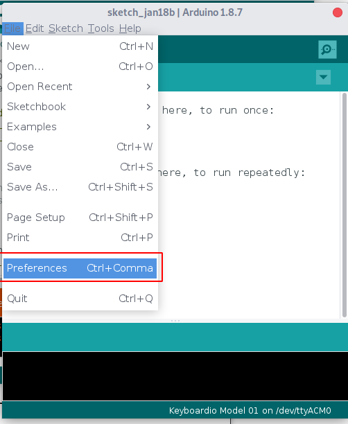
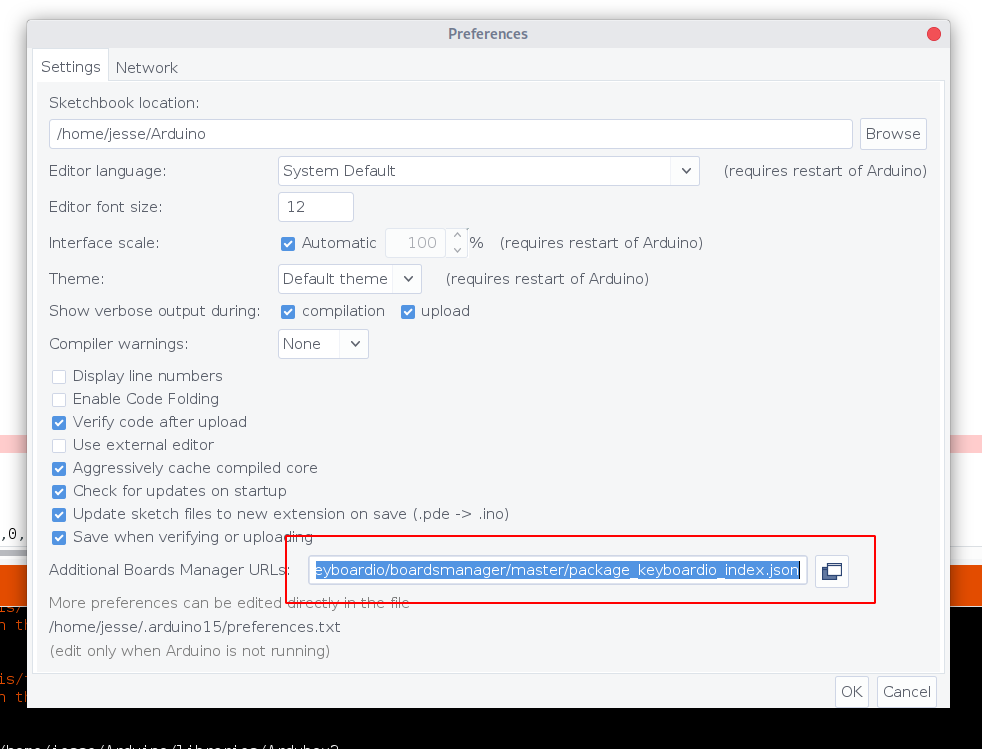
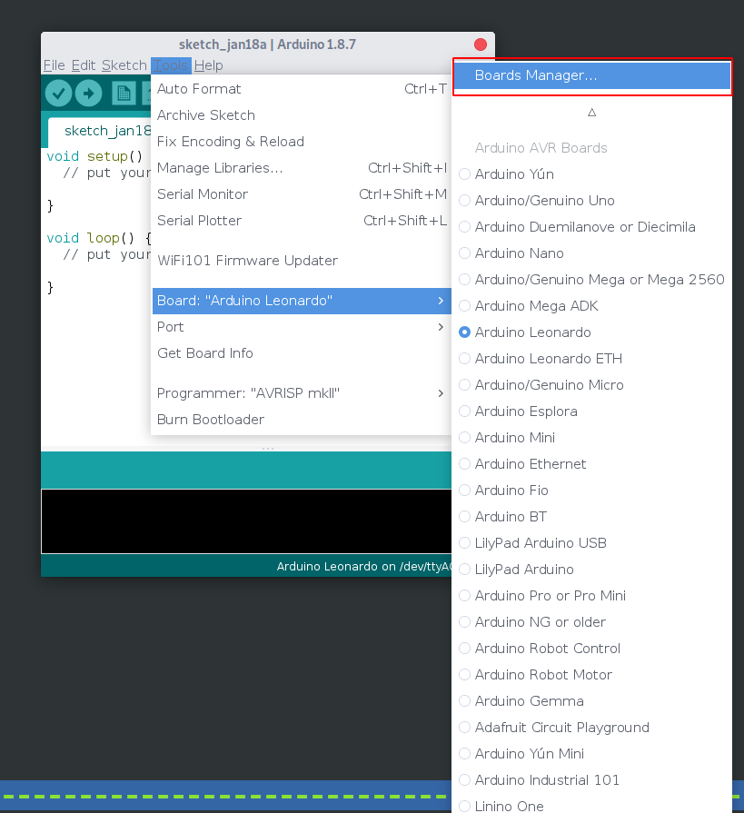
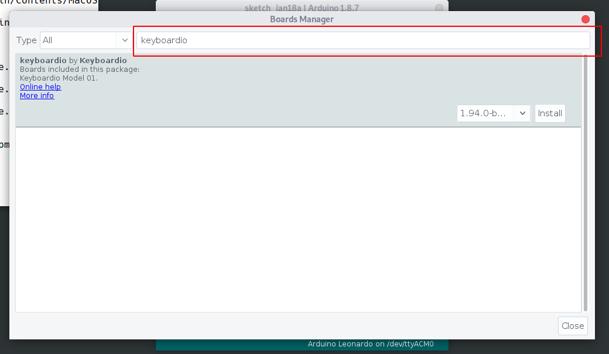
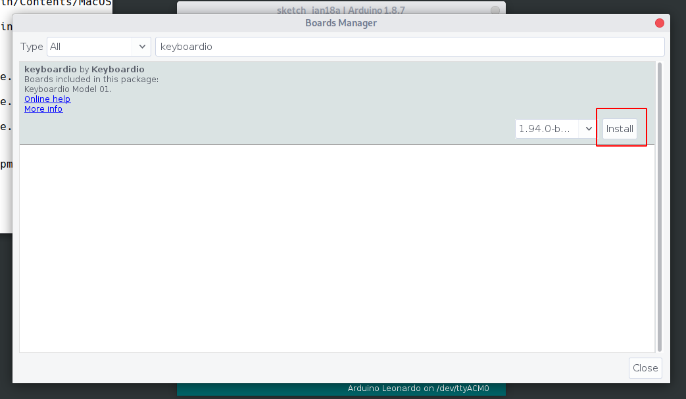
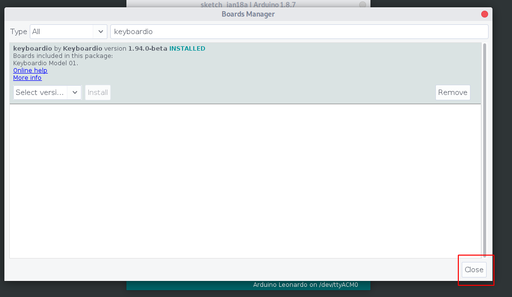
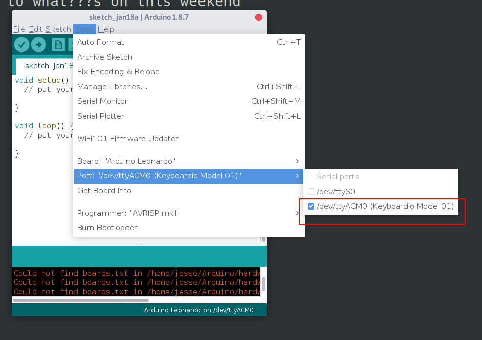
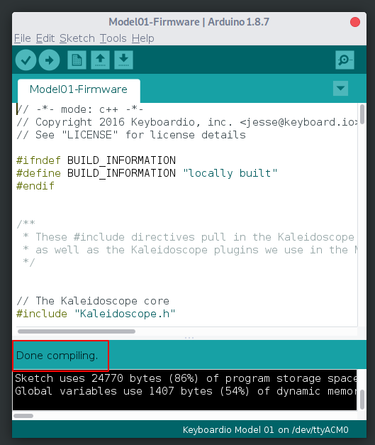
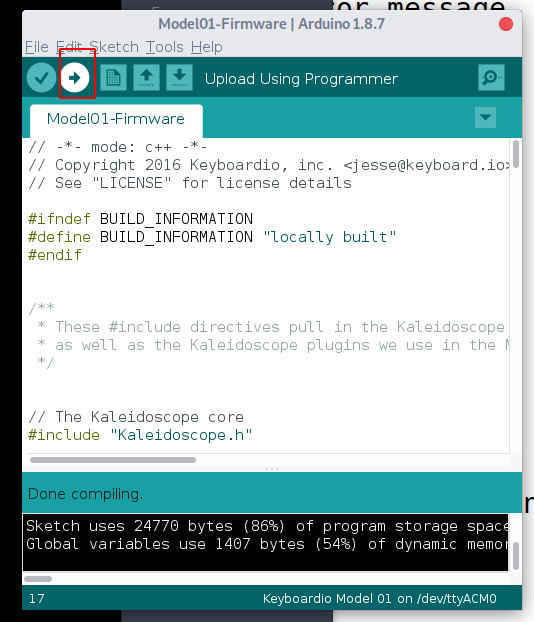

# Setting up your development environment

If you'd like to customize your keyboard's layout or functionality, the most robust and flexible option is to use the Arduino IDE. 

Arduino is one of the world's most widely used (and user friendly) platforms for programming "embedded" devices like the chip inside your keyboard. 


# Set up the Arduino IDE

Arduino's designers made it to be accessible to people at all skill levels, and Kaleidoscope is built on top of the Arduino platform because we share that goal. The easiest way to customize your keyboard's firmware is to use the Arduino IDE. Even if you expect to use the command line to compile your firmware, you'll still need to install Arduino, as they provide the compilers and libraries Kaleidoscope needs to work. 

Using the IDE is is the easiest process for folks who are new to Arduino, or to programming generally. If you follow the instructions below step by step you should be fine. :-)


The right way to install Arduino is a little bit different depending on what operating system you use.

* [Install Arduino on macOS](#Arduino-macOS)
* [Install Arduino on Linux](#Arduino-Linux)
* [Install Arduino on Windows 10](#Arduino-Windows)
* [Install Arduino on FreeBSD](#Arduino-FreeBSD)


## <a name="Arduino-macOS"/>Install Arduino on macOS


1. Download the Arduino IDE install package from https://www.arduino.cc/en/Main/Software

As of this writing, the latest version is v1.8.13, which you can download from https://www.arduino.cc/download_handler.php?f=/arduino-1.8.13-macosx.zip

2. Double-click "arduino-1.8.13-macos.zip" to uncompress the Arduino IDE. 

3. Move Arduino.app from your `Downloads` folder to your Applications folder.

4. Double-click on Arduino.app to start it.

Next step: [Add keyboard support to Arduino](#Add-keyboard-support-to-Arduino)


# <a name="Arduino-Linux"/>Install Arduino on Linux

1. Install version 1.8.13 or newer of the Arduino IDE from http://arduino.cc/download.  Unfortunately, the version packaged in Ubuntu is too ancient to support Arduino's new way of doing 3rd-party hardware.

2. Assuming you're untarring in the download directory:

    ```sh
    $ cd ~/Downloads
    $ tar xvf arduino-1.8.13-linux64.tar.xz
    $ sudo mv arduino-1.8.13 /usr/local/arduino
    $ cd /usr/local/arduino
    $ sudo ./install.sh
    ```
3. On Ubuntu, you will have to prevent ModemManager from attempting to grab the keyboard virtual serial port when it goes into bootloader mode:

    ```sh
    $ wget https://raw.githubusercontent.com/keyboardio/Kaleidoscope/master/etc/99-kaleidoscope.rules
    $ sudo cp 99-kaleidoscope.rules /etc/udev/rules.d
    $ sudo /etc/init.d/udev reload
    ```

4. Then disconnect and reconnect the keyboard for that change to take effect.

5. To let Arduino talk to the device over the serial port, you'll need to be in the appropriate group.  On Ubuntu and some other Linux distributions, the group you need is the 'dialout' group.

    From a shell:

    ```sh
    $ groups 
    ```

    If you see dialout in the list, you're good to go. If you don't, you'll have to add yourself and then get Linux to recognize the change in your current shell:

    ```sh
    $ sudo usermod -a -G dialout $USER
    $ newgrp dialout   # or su - $USER, or log out and in again
    ```

    On Arch linux, Manjaro linux, and probably other Arch derivatives, the group for the device access is `uucp`. To add yourself to this group if necessary, use

    ```shq
    $ sudo usermod -a -G uucp $USER
    $ newgrp uucp   # or su - $USER, or log out and in again
    ```

6. You may have to tweak the `ARDUINO_PATH` (put this line in your shell-rc)

    ```sh
    export ARDUINO_PATH=/usr/local/arduino
    ```

Next step: [Add keyboard support to Arduino](#Add-keyboard-support-to-Arduino)

# <a name="Arduino-Windows"/>Install Arduino on Windows 10


_**Note:** This tutorial has been written using Windows 10._


1. Download the Arduino IDE installation package from https://www.arduino.cc/en/Main/Software

As of this writing, the latest version is v1.8.13, which you can download from this URL:

https://www.arduino.cc/download_handler.php?f=/arduino-1.8.13-windows.exe

_**Note:** Some users have had difficulties with the Windows store version of the Arduino IDE. Please use the downloadable installation package._

2. Open the installation package and follow the prompts to install the Arduino IDE.

Next step: [Add keyboard support to Arduino](#Add-keyboard-support-to-Arduino)

## <a name="Arduino-FreeBSD"/>Install Arduino on FreeBSD

1. Install the following packages required by the build system: `bash`, `gmake`, `perl5`, `avrdude`, and `arduino18`.

   ```sh
   $ sudo pkg install bash gmake perl5 avrdude arduino18
   ```

### Flashing firmware as non-root.

1. If you want to flash your firmware as non-root, ensure your user has write access to the appropriate USB devices in devfs. By default, the devices are owned by `root`:`operator`, so put yourself in the `operator` group. You will also need to add yourself to the `dialer` group to use the modem device:

      ```sh
      $ sudo pw groupmod operator -m $USER
      $ sudo pw groupmod dialer -m $USER
      ```

1. Add devfs rules for write access for operator to USB devices:

      ```sh
      $ cat << EOM >> /etc/devfs.rules
      #
      # Allow operators access to usb devices.
      #
      [operator_usb=5]
      add path usbctl mode 0660 group operator
      add path 'usb/*' mode 0660 group operator
      add path 'ugen*' mode 0660 group operator
      EOM
      ```

1. Update `/etc/rc.conf` to use the new devfs rule as the system rule:

      ```sh
      $ sudo sysrc devfs_system_ruleset=operator_usb
      ```

1. Restart devfs:

      ```sh
      $ sudo service devfs restart
      ```

Next step: [Add keyboard support to Arduino](#Add-keyboard-support-to-Arduino)


# <a name="Add-keyboard-support-to-Arduino"/>Add keyboard support to Arduino

1. Open the Arduino IDE. It will open an empty "sketch" window. 

2. On Windows or Linux: Open the "File" menu, and click on "Preferences." 
   On a Mac: Open the "Arduino" menu, and click on "Preferences."



3. Paste the following url into the box labeled 'Additional Board Manager URLs':
   ```
   https://raw.githubusercontent.com/keyboardio/boardsmanager/master/package_keyboardio_index.json
   ```


4. Click ‘OK’ to close the dialog

5. Open the ‘Tools’ menu, click on ‘Board’ and then click on ‘Boards Manager’



6. Type ‘Keyboardio’ into the search box. 



7. You will see an entry that says "keyboardio by Keyboardio" click on it to select it, and then click ‘Install’. 



8. Once the install completes, click "Close".



9. Open the 'Tools' menu, click on 'Board' and then click on the name of your keyboard. In the screenshot, we picked 'Keyboardio Model 01'. (You may have to scroll through a long list of other boards to get there.)


10. Open the 'Tools' menu, click on "Port > ".  If your keyboard is not already selected, click on it to select it. (If there is only one option such as "COM3" try it, it's almost certainly the correct port.)



Next step: [Install the latest firmware on your keyboard](Install-latest-firmware)

# <a name="Install-latest-firmware" />Install the latest firmware on your keyboard

# Load the example (default) firmware source code sketch

To load the firmware, open the Arduino IDE's "File" menu, and click on the "Examples" submenu. 

If you're using a Keyboardio Model 01, Scroll down to 'Model01-Firmware':


If you're using another keyboard, you should find it under Examples -> Kaleidoscope -> Devices -> (Your keyboard maker) -> (Your keyboard)

After you pick your example sketch, Arduino wil open a new window showing the sketch's source code above a black message log section and a green status message bar at the bottom. The message log displays detailed information about what Arduino is doing.

_**Note:**  We recommend that you install the default firmware at least once before you start to make changes. This gives you a chance to ensure that the firmware update process works._

# Build the firmware

Click the check mark icon below "File" to build your firmware. 


If the firmware builds successfully, Arduino reports "Done Compiling" in the green status bar.



If something goes wrong, the status bar turns orange and displays an error message. Additionally, there may be text in the black message log with more details about the error. At this point, it may be helpful to expand the message log so that you can see a bit more about what's going on.


If you see errors, refer to [Getting help](Getting-help) for troubleshooting tips and useful resources.

# Install the firmware

If your keyboard has a programming interlock key, you'll need to hold it down now. On the Keyboardio Model 01, this is the `Prog` key. On the Keyboardio Atreus, this is the `Esc` key.

Without releasing that key, click on the "right arrow" button in the sketch window menu bar. This starts the firmware installation process.


 


If the process is successful, Arduino will tell you that in the status area. Some keyboards may also use LEDs to report their results. For example, the Model 01's LED's flash red across the board as the firmware is installed, and then the "LED" key glows blue. 

On Windows, you may also see the message "the device Model 01 is undergoing additional configuration." 

If you have any trouble flashing your keyboard's firmware, check to see if the issue is addressed on the [Troubleshooting Firmware Upload Issues](https://github.com/keyboardio/Kaleidoscope/wiki/Troubleshooting-Firmware-Upload-Issues)

